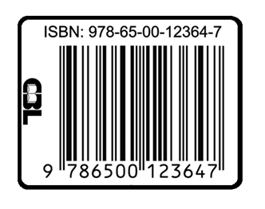

# Licenciamento {-}


```{r, echo=FALSE, out.width="height=4in,width=3in",fig.align = 'center'}
knitr::include_graphics("licenca_isbn.png")
```

# ISBN {-}
```{r, echo=FALSE, out.width="height=4in,width=3in",fig.align = 'center'}

```

# Ficha Catalográfica {-}